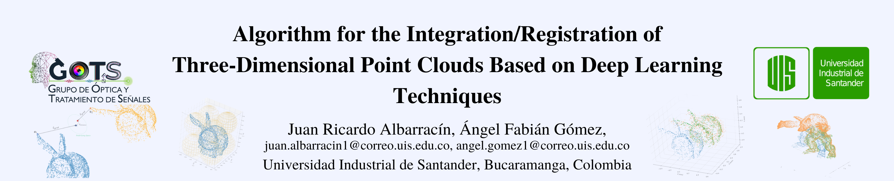

ESPAÑOL:
# Algoritmo de Registro Profundo de Nube de Puntos

Bienvenido a nuestro proyecto.

Este proyecto fue propesto como proyecto de grado para aspirar al titulo de Ingeniero de Sistemas en la Universidad Industrial de Santander.

El desarrollo de este proyecto se basa en los aportes significativos del proyecto DPDist desarrollado por [Dahlia Urbach](https://www.linkedin.com/in/dahlia-urbach-97a816123/), [Yizhak Ben-Shabat (Itzik)](http://www.itzikbs.com), y [Michael Lindenbaum](http://www.cs.technion.ac.il/people/mic/index.html) from Technion.

El link del proyecto DPDist es el siguiente: https://github.com/dahliau/DPDist

Con el continuo desarrollo de las técnicas de reconstrucción tridimensional (3D) y el aumento de las aplicaciones en diferentes ramas de la ciencia en las que esta tecnología puede tener cabida, han surgido multitud de metodologías que intentan solucionar los problemas de registrar y alinear nubes de puntos ubicadas en posiciones aleatorias o cuando no tienen una estimación de la transformación que las diferencia. En este proceso de reconstrucción 3D, después de escanear u obtener datos desde diferentes puntos de vista, uno de los principales desafíos es establecer los puntos correspondientes entre las diferentes capturas para alinear correctamente ese par de nubes de puntos (integración o registro) en base a un mismo sistema de referencia. Es necesario ajustar y alinear las nubes de puntos correspondientes a los escaneos del objeto o escena en cuestión para poder realizar la reconstrucción o digitalización para cual sea su aplicación. En este trabajo de investigación se propone un algoritmo que involucra técnicas de Aprendizaje Profundo para obtener un correcto registro de nubes de puntos capturadas en ambientes de oclusión, alta reflectancia y datos faltantes.

Video explicativo: https://mailuis-my.sharepoint.com/personal/famarcar_uis_edu_co/_layouts/15/stream.aspx?id=%2Fpersonal%2Ffamarcar%5Fuis%5Fedu%5Fco%2FDocuments%2FGrabaciones%2FInvitaci%C3%B3n%20Sustentaci%C3%B3n%20Proyecto%20de%20Grado%20de%20los%20estudiantes%20Juan%20Ricardo%20Albarracin%20y%20%C3%81ngel%20Fabian%20G%C3%B3mez%2D20220824%5F080053%2DGrabaci%C3%B3n%20de%20la%20reuni%C3%B3n%2Emp4&ga=1

ENGLISH:
# Deep Point Cloud Registration Algorithm

Welcome to our project.

This project was proposed as a bachelor project to aspire to the title of Systems Engineer at the Universidad Industrial de Santander.

The development of this project is based on the significant contributions of the DPDist project developed by [Dahlia Urbach](https://www.linkedin.com/in/dahlia-urbach-97a816123/), [Yizhak Ben-Shabat (Itzik)] (http://www.itzikbs.com), and [Michael Lindenbaum](http://www.cs.technion.ac.il/people/mic/index.html) from Technion.

The link of the DPDist project is the following: https://github.com/dahliau/DPDist

With the continuous development of three-dimensional (3D) reconstruction techniques and the increase in applications in different branches of science in which this technology can have a place, a multitude of methodologies have emerged that try to solve the problems of registering and aligning clouds of points located in random positions or when they do not have an estimate of the transformation that differentiates them. In this 3D reconstruction process, after scanning or obtaining data from different points of view, one of the main challenges is to establish the corresponding points between the different captures to correctly align that pair of point clouds (integration or registration) based on the same reference system. It is necessary to adjust and align the point clouds corresponding to the scans of the object or scene in question in order to perform the reconstruction or digitization for whatever your application. In this research work, an algorithm that involves Deep Learning techniques is proposed to obtain a correct registration of point clouds captured in occlusion environments, high reflectance and missing data.

Explanatory video: https://mailuis-my.sharepoint.com/personal/famarcar_uis_edu_co/_layouts/15/stream.aspx?id=%2Fpersonal%2Ffamarcar%5Fuis%5Fedu%5Fco%2FDocuments%2FGrabaciones%2FInvitaci%C3%B3n%20Sustentaci%C3%B3n%20Proyecto%20de%20Grado%20de%20los%20estudiantes%20Juan%20Ricardo%20Albarracin%20y%20%C3%81ngel%20Fabian%20G%C3%B3mez%2D20220824%5F080053%2DGrabaci%C3%B3n%20de%20la%20reuni%C3%B3n%2Emp4&ga=1
